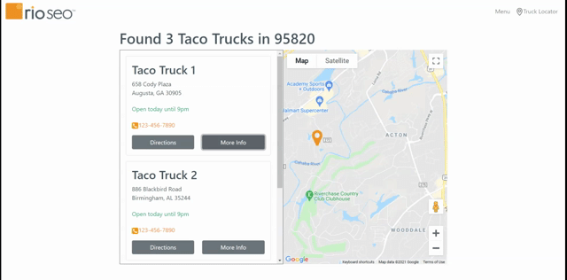

# Taco Truck!

## Description

Taco Truck is a fully mobile responsive app that will help you sate your taco cravings. Utilizing the building blocks of front end design, in conjunction with Bootstrap, jQuery, and Google Maps API, this app is lightning quick so you can get your lunch on the fly.

## Installation

Deployed application:

https://raskog1.github.io/taco-truck/

## Usage

## Technology Used in Development

- HTML5
- CSS3
- Bootstrap
- JavaScript
- jQuery
- Google Maps API

## Roadmap

Future releases will include many more features including menu selections, mobile ordering, and more! Stay posted.

## Contact

Please contact me at [ryan.skog@outlook.com](ryan.skog@outlook.com) with any questions, concerns, or opportunities.
